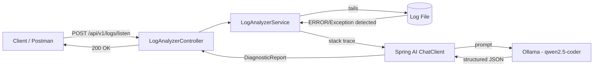

# 🔍 Log Analyzer — AI-Powered Java Stack Trace Diagnostics

> Real-time log tailing meets local LLM inference: a Spring Boot service that watches your application logs, detects errors as they happen, and returns structured AI-generated diagnostic reports — powered by Spring AI + Ollama, fully containerized.

[](https://openjdk.org/)
[](https://spring.io/projects/spring-boot)
[](https://spring.io/projects/spring-ai)
[](https://www.docker.com/)
[](https://ollama.com/)
[](LICENSE)

---

## 💡 Why this project

Every backend developer knows the drill: an error hits production, you tail the logs, squint at a 40-line stack trace, and start piecing together what broke. This project automates the "squinting" part.

**Log Analyzer** watches a log file in real time, detects the moment an `ERROR` or exception is written, and sends the captured stack trace to a locally-running LLM (via [Ollama](https://ollama.com/)) for a structured, human-readable diagnosis — no data leaves your machine.

Built to demonstrate practical, production-style patterns in **Spring Boot**, **Spring AI**, async Java, and containerized deployment — not just a toy CRUD app.

---

## ✨ Features

- **Real-time file tailing** using Apache Commons IO `Tailer`, with automatic detection of error/exception blocks in a live log stream
- **Structured AI output** — Spring AI's `.entity()` support forces the LLM to return a strongly-typed `DiagnosticReport` record (`summary`, `rootCause`, `suggestedFix`, `severity`), not free-form text
- **Fully async, non-blocking pipeline** built on `CompletableFuture`, with configurable timeouts
- **Centralized exception handling** via `@RestControllerAdvice` — consistent JSON error responses for validation failures, timeouts, and internal errors
- **Local-first AI inference** — runs against Ollama, so no API keys, no per-token cost, no data sent to third-party AI providers
- **Fully containerized** with Docker Compose — the app and the Ollama model server spin up together with a single command

---

## 🏗️ Architecture



---

## 🛠️ Tech Stack

| Layer | Technology |
|---|---|
| Language | Java 21 |
| Framework | Spring Boot 4.1.1 |
| AI Integration | Spring AI 2.0.1 (Ollama starter) |
| LLM Runtime | Ollama (`qwen2.5-coder:3b`) |
| File Watching | Apache Commons IO `Tailer` |
| Build Tool | Maven |
| Containerization | Docker & Docker Compose |
| Validation | Jakarta Bean Validation |

---

## 🚀 Quick Start

### Prerequisites
- [Docker Desktop](https://www.docker.com/products/docker-desktop/) installed and running

### Run it

```bash
https://github.com/mhamadghourani/log-analysis.git
cd log-analyzer
docker compose up -d --build
```

Pull the model into the running Ollama container (first run only):

```bash
docker exec -it ollama ollama pull qwen2.5-coder:3b
```

That's it — the API is now live at `http://localhost:8080`.

---

## 📡 API Usage

### `POST /api/v1/logs/listen`

Starts tailing the given log file and returns as soon as an error/exception is detected and analyzed.

**Request**
```json
{
  "logPath": "/app/logs/app.log"
}
```

**Response — `200 OK`**
```json
{
  "summary": "NullPointerException in OrderService",
  "rootCause": "A required dependency was not injected before use.",
  "suggestedFix": "Verify @Autowired configuration and check for circular dependencies.",
  "severity": "High"
}
```

**Response — `408 Request Timeout`** (no matching error within the configured window)
```json
{
  "timestamp": "2026-09-14T10:00:00Z",
  "status": 408,
  "error": "Timed out",
  "message": "Timed out waiting for an error log to be written.",
  "path": "/api/v1/logs/listen"
}
```

---

## 📁 Project Structure

```
src/main/java/com/mostack/loganalizer/
├── controller/
│   ├── LogAnalyzerController.java
│   └── GlobalExceptionHandler.java
├── service/
│   └── LogAnalyzerService.java
└── record/
    ├── DiagnosticReport.java
    ├── LogListenRequest.java
    └── ApiError.java
```

---

## 🗺️ Roadmap

- [ ] Support tailing multiple log files concurrently
- [ ] WebSocket/SSE endpoint for streaming diagnostics as they happen, instead of a single blocking response
- [ ] Configurable LLM provider (swap Ollama for OpenAI/Anthropic via Spring AI's abstraction)
- [ ] Persist diagnostic history to a database
- [ ] Slack/email notification integration on critical severity

---

## 👋 About Me

I'm a Spring Boot developer focused on building practical backend systems — from REST APIs to AI-integrated services like this one. Currently exploring **Spring AI** in depth and looking for opportunities as a **Spring Boot / Spring AI Developer**.

- 💼 LinkedIn: https://www.linkedin.com/in/mohamad-al-ghourani-3b3aa5208/
- 📧 Email: mhmd.ghourani@gmai.com
- 🧑‍💻 Contra: https://contra.com/mohamad_al_ghourani_eiyynqwv?referralExperimentNid=DEFAULT_REFERRAL_PROGRAM&referrerUsername=mohamad_al_ghourani_eiyynqwv

If you're hiring or want to talk shop about Spring, AI integration, or backend architecture — feel free to reach out.

---

## 📄 License

This project is licensed under the MIT License — see the [LICENSE](LICENSE) file for details.
